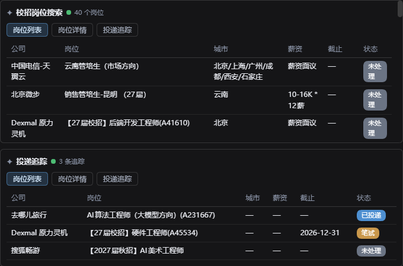
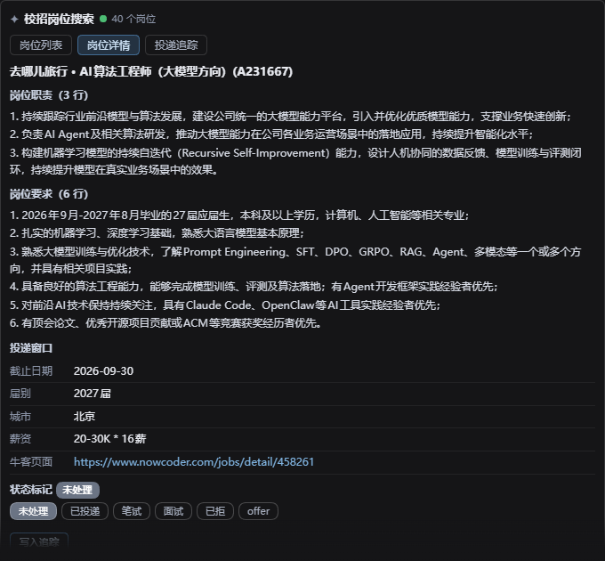
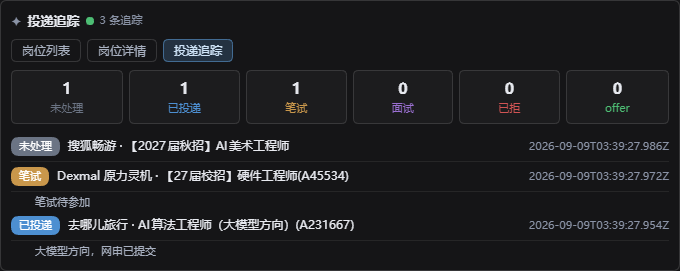

# dsh-campus-hunt
[中文](../README.md) | English

> A DSH (DeepSeek Harness) client plugin for the campus job hunt
> (Nowcoder channel): 4 host tools (job search / JD detail / campus schedule /
> application tracking) + a 3-tab answer-area GUI card (list · detail · track),
> local-first data layer, read-only collection.

## Latest Version
**v0.1.1**

## Introduction

dsh-campus-hunt is a campus-recruitment plugin for the DSH Web GUI. The browser
side is all the agent's job: it drives the `ego_*` tools of the
[dsh-ego-browser](https://github.com/Fisfzy/dsh-ego-browser) browser
collection backend (required; see the Installation Guide) to open Nowcoder
(nowcoder.com) campus pages: job list, JD detail, schedule. The plugin's tools do one thing: normalize and
deduplicate the extracted data, then store it in JSON files in the session
workspace.

Every tool call renders an interactive job card in the GUI answer area (at the
end of the turn; job list / detail / application tracking tabs); the settings
card keeps your job profile,
the special-activity page URL, the collection domain whitelist, and the
rate-limit red lines.

- Local-first: all data lives in the current session workspace
  (three files: `jobs.json` / `track.json` / `schedule.json`); no cloud
  service, no fixed personal directory, and the data never leaves the workspace.
- Read-only collection: it reads job lists, JDs, and schedules. It never
  applies, sends messages, logs in, or bypasses CAPTCHAs.
- Agent-driven browser: the tools do no network I/O of their own and have no
  heavy dependencies like playwright or puppeteer. A cohort switch or a new
  special-activity URL is handled in the settings card, no skill change needed.
  When the site structure changes, you update the extraction expressions in
  the skill.

## What's covered

Supported:

- Nowcoder (nowcoder.com) campus recruitment: job list (the formal fall
  batch special-activity page), JD details (public without login), and the
  campus schedule (which companies have opened / are about to open);
- 4 host tools: `campus_job_search` (job collection & storage) /
  `campus_job_detail` (JD detail, one at a time) / `campus_schedule` (campus
  schedule) / `job_track` (application pipeline, pure local, no network);
- Answer-area GUI card with three tabs (job list / detail / application
  tracking), shown at the end of the turn in both compact and normal display
  modes; local interactions (tab switch, status marking) are zero-round-trip;
  actions that need the agent go back through action callbacks;
- Settings card (the `campus-hunt` section in the GUI settings page): job
  profile (directions / cities / target companies), Nowcoder collection config
  (domain whitelist `allowedDomains` / per-run item cap / navigation interval),
  resume file path, and the special-activity page URL (Nowcoder fall batch
  special page, default the 27th cohort 2027QZzc page);
- Personalized recommendation: when the user asks "recommend jobs for me" /
  "which jobs suit me", the skill uses the profile line returned by
  `campus_job_search` (the profile lives only in the settings section, with
  no workspace copy; when the
  current session has no such return, a zero-side-effect `raw=[]` query call
  comes first) to semantically filter & rank by directions / cities / target
  companies, outputting a shortlist with a per-item matching reason; with an
  empty profile it shows the full list and points to the settings card;
  recommendations never re-collect;
- Data layer: three files with a unified `{ "schema": 0, "data": ... }` envelope
  (see [workspace data files](./workspace-output.en.md)).

Not in scope (explicit non-goals):

- No auto-apply, no login, no credential storage, no CAPTCHA bypass;
- No resume parsing or rule-based JD matching scoring (not implemented yet;
  the model-based semantic recommendation by profile is supported, see
  "Personalized recommendation" above);
- No sites other than Nowcoder (JS-heavy sites like company websites);
- No desktop shortcuts, no standalone scheduler, no interview reminders;
- No multi-user or cloud: pure local, single user.

## Installation

```powershell
dsh plugin --profile web add github:coderHeJiyu/dsh-campus-hunt
```

Installs straight from the GitHub repository (HEAD of the default branch).
Prerequisites (DSH / Node.js / pnpm / dsh-ego-browser), verification, from-source
installation, updating and uninstalling: see the [Installation Guide](./installation.en.md).

## Security

- Collection scope: only pages whose domain is in the `allowedDomains`
  whitelist (default `nowcoder.com`, host-suffix match); entries with a URL
  outside the whitelist are skipped or rejected, never stored.
- Read-only promise: lists, JDs, and schedules are read and stored only. No
  applications, no messages, no form filling, no registrations.
- No login / CAPTCHA bypass: login popups are dismissed with Escape and
  recorded; when a login wall or CAPTCHA blocks content, the plugin stops
  immediately and reports to the user. No retries, no bypass attempts.
- Credentials are never requested: no account, password, cookie, or
  credential is ever asked for or stored.
- Rate red lines only tighten: at most 50 items per run (range 1–50) and at
  least 1 second between page navigations (range 1–600 s); the settings card
  can only make these stricter, never looser. JD details are collected one at a
  time; only the first screen is collected, with no paging and no "load more".
- Local-first, data never leaves the workspace: everything is written to the
  current session workspace. Nothing is uploaded or synced.

- [More](./security.en.md)

## Screenshot

Answer-area job card (Nowcoder fall recruitment jobs; list / detail / track tabs):







## Documentation

| Doc | 中文 | English |
|---|---|---|
| Installation guide | [installation.zh.md](./installation.zh.md) | [installation.en.md](./installation.en.md) |
| Full security statement | [security.zh.md](./security.zh.md) | [security.en.md](./security.en.md) |
| Workspace data files | [workspace-output.zh.md](./workspace-output.zh.md) | [workspace-output.en.md](./workspace-output.en.md) |
